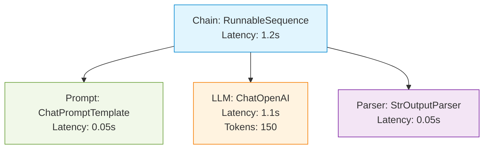

# Basic Tracing Demo (Theory & Visualization)

This document accompanies `04_basic_tracing_demo.py` and explains the theory behind tracing a standard LangChain call.

## Theory: The Trace Tree

When you invoke a simple chain in LangChain, LangSmith does not just record the final output. It records a hierarchical **Trace Tree**. 

Every step in the chain is recorded as a "Run" (specifically, a child run of the main execution). This allows you to inspect exactly how the prompt was formatted before it was sent to the model provider (like OpenAI).

## Visualization: The LangSmith Trace

Below is a visualization of what this trace looks like inside the LangSmith dashboard.

### Breakdown:
1. **RunnableSequence (Root Node):** This represents the entire `prompt | llm | parser` pipeline. It measures the total time the user waited.
2. **ChatPromptTemplate:** Shows the raw template variables injected (e.g., `input: "Explain what LangSmith is..."`) and the resulting formatted string.
3. **ChatOpenAI:** The actual API call to the model provider. This is the most critical node as it tracks **token usage (cost)** and **generation latency**.
4. **StrOutputParser:** Shows how the raw `AIMessage` object was converted into a simple python string.
