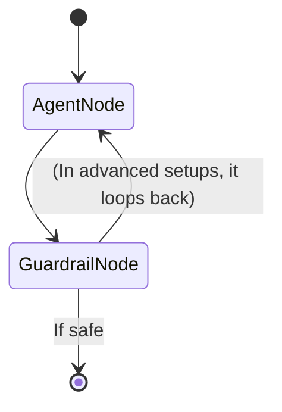
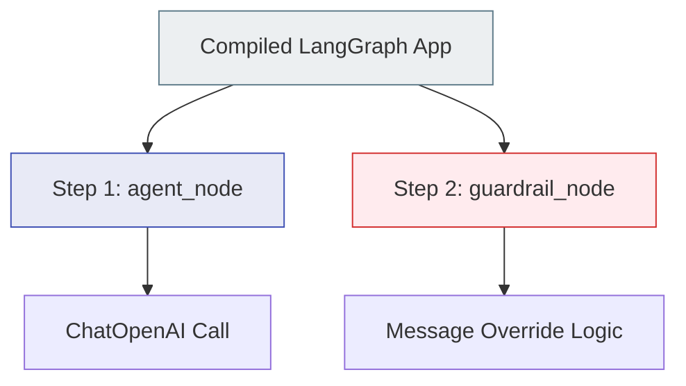

# LangGraph Integration (Theory & Visualization)

This document accompanies `07_langgraph_integration.py`.

## Theory: Tracing State Machines

LangGraph utilizes cyclical graphs (state machines) rather than linear chains. An agent might think, call a tool, evaluate the tool, realize it made a mistake, and call another tool. 

LangSmith natively understands LangGraph's `StateGraph`. When an application loops, LangSmith groups those loops logically.

## Visualization: StateGraph and Execution Trace

### 1. The Application Graph Structure
This is the physical layout of the agent we built in Python:

### 2. The LangSmith Trace Output
When the graph executes, LangSmith creates a trace that groups executions by graph steps. In our demo (where the guardrail was triggered), the trace looks like this:

### Why LangGraph Needs LangSmith
If an agent gets stuck in an infinite loop, looking at standard terminal logs is a nightmare. LangSmith allows you to click on `Step 45` of a loop, see exactly what the agent's state was at that exact moment, and understand why it decided to loop again.
