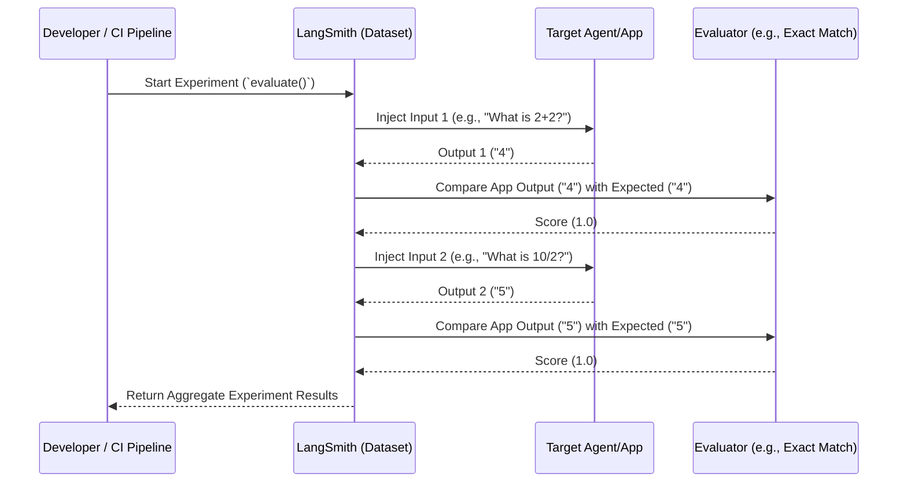

# Evaluations and Datasets (Theory & Visualization)

This document accompanies `08_evals_and_datasets.py`.

## Theory: The Evaluation Loop

In traditional software, you write unit tests (`assert 2 + 2 == 4`). In Generative AI, outputs are non-deterministic, so you use **Evaluations (Evals)**. 

LangSmith makes this process seamless by allowing you to:
1. Curate a **Dataset** (a collection of inputs and expected outputs).
2. Define a **Target** (your agent, RAG chain, or LLM function).
3. Define an **Evaluator** (a scoring function, often another LLM acting as a judge).
4. Run an **Experiment** which processes the dataset and logs the aggregate scores.

## Visualization: The Evaluation Architecture

Below is a visualization of what happens when you call the `evaluate()` function in LangSmith.

### CI/CD Integration
The ultimate goal of this setup is to integrate it into GitHub Actions. If a pull request modifies an agent prompt, an automated action runs the LangSmith Evaluation. If the aggregate score drops below 90%, the pull request is blocked. This is how you confidently ship Agentic AI to production.
