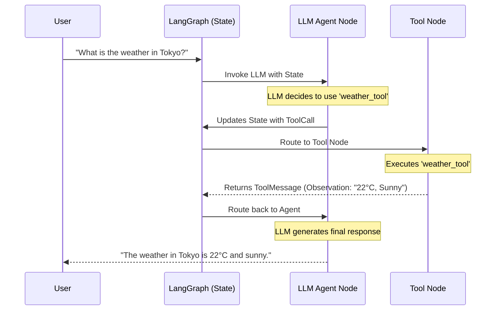
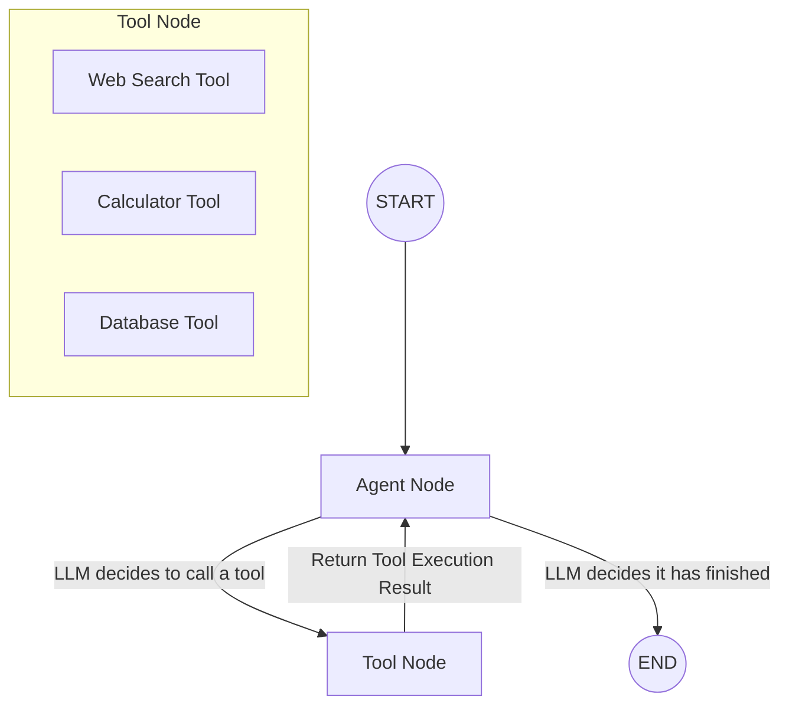

# Tools in LangGraph: A Comprehensive Guide

Tools are the interfaces that allow an LLM or Agent to interact with the outside world. Instead of just generating text, an agent with tools can search the web, execute code, query a database, or call an external API.

In LangGraph (which relies heavily on LangChain's tool abstractions), tools are structured functions that an LLM can invoke.

---

## 1. Visualizing the Tool Calling Workflow

When an agent uses tools in LangGraph, it generally follows a cyclic pattern. The agent decides what to do, calls the tool, receives the observation, and decides the next step.





---

## 2. Types of Tools in LangChain / LangGraph

LangChain provides a vast ecosystem of pre-built tools. They generally fall into the following categories:

### A. Search and Information Retrieval
These tools allow the agent to look up real-time or factual information.
*   **Tavily Search (`TavilySearchResults`):** The recommended search engine for AI agents.
*   **Wikipedia / Arxiv:** For academic and factual lookups.
*   **Retrievers as Tools:** Wrapping your custom RAG vector database into a tool using `create_retriever_tool`.

### B. Math and Logic
For operations where LLMs are notoriously bad (like arithmetic).
*   **Calculator (`numexpr`):** Evaluates mathematical expressions accurately.

### C. System and OS Interaction
Tools that allow the agent to interact with the local environment.
*   **Python REPL:** Allows the agent to execute Python code (Use with caution!).
*   **Shell Tool:** Allows the agent to run terminal commands.
*   **File System Tools:** Reading, writing, and listing files.

### D. APIs and Integrations
Connecting to external services.
*   **GitHub Toolkit:** Creating issues, reading repos.
*   **Slack / Discord:** Sending messages.
*   **SQL Database Toolkit:** Querying databases directly.

---

## 3. How to Create Custom Tools

While built-in tools are great, you will often need to create custom tools specific to your business logic. There are three main ways to do this in LangChain/LangGraph.

### Method 1: The `@tool` Decorator (Easiest & Most Common)
The simplest way to create a tool is by writing a regular Python function and adding the `@tool` decorator. 

**Crucial:** The LLM relies entirely on the **Docstring** and **Type Hints** to understand what the tool does and how to use it.

```python
from langchain_core.tools import tool

@tool
def get_user_data(user_id: int) -> dict:
    """
    Fetches the profile data for a specific user.
    Always use this when you need to know a user's name, email, or role.
    
    Args:
        user_id: The unique integer ID of the user.
    """
    # Simulated database lookup
    db = {
        1: {"name": "Alice", "role": "Admin"},
        2: {"name": "Bob", "role": "User"}
    }
    return db.get(user_id, {"error": "User not found"})

# The tool name is automatically inferred from the function name
print(get_user_data.name)        # get_user_data
print(get_user_data.description) # Fetches the profile data...
```

### Method 2: Pydantic Schemas for Complex Inputs
If your tool requires complex, nested inputs, you should define a Pydantic schema. This strictly enforces the structure of the data the LLM passes to the tool.

```python
from langchain_core.tools import tool
from pydantic import BaseModel, Field

# 1. Define the Schema
class WeatherInput(BaseModel):
    city: str = Field(description="The name of the city, e.g., 'London'")
    unit: str = Field(
        default="celsius", 
        description="The temperature unit, either 'celsius' or 'fahrenheit'"
    )

# 2. Attach the schema to the tool
@tool(args_schema=WeatherInput)
def get_weather(city: str, unit: str = "celsius") -> str:
    """Get the current weather for a specific city."""
    # Logic to call a weather API goes here
    return f"The weather in {city} is 24 degrees {unit}."
```

### Method 3: Subclassing `BaseTool` (For Advanced Control)
If you need maximum control (like handling asynchronous execution or custom initialization logic), you can subclass `BaseTool`.

```python
from langchain_core.tools import BaseTool
from pydantic import BaseModel, Field
from typing import Optional, Type

class CalculatorInput(BaseModel):
    a: int = Field(description="First number")
    b: int = Field(description="Second number")

class MultiplyTool(BaseTool):
    name: str = "multiplier_tool"
    description: str = "Multiply two numbers together. Use this for math."
    args_schema: Type[BaseModel] = CalculatorInput
    
    # Synchronous implementation
    def _run(self, a: int, b: int) -> int:
        return a * b
        
    # Asynchronous implementation (optional but recommended for async apps)
    async def _arun(self, a: int, b: int) -> int:
        return a * b
```

---

## 4. Best Practices for Tool Design

1.  **Clear Docstrings:** The LLM does not read your code; it only reads the tool's description. Be highly specific about *when* to use it and *what* it returns.
2.  **Explicit Type Hints:** Use Python type hints (`int`, `str`, `list`) so the LLM knows exactly how to format its tool call arguments.
3.  **Handle Errors Gracefully:** If a tool crashes, the whole graph might crash. Catch exceptions inside the tool and return a helpful string back to the LLM (e.g., `"Error: Could not find user. Please try a different ID."`). This allows the LLM to self-correct.
4.  **Keep it Focused:** A tool should do exactly one thing well. Instead of an all-in-one `database_tool`, create a `read_database_tool` and a `write_database_tool`.

## 5. Integrating Tools into LangGraph

To use these tools in LangGraph, you typically bind them to an LLM and use a `ToolNode`.

```python
from langgraph.prebuilt import ToolNode
from langchain_openai import ChatOpenAI

# 1. Define your tools
tools = [get_user_data, get_weather]

# 2. Bind tools to the LLM
llm = ChatOpenAI(model="gpt-4o")
llm_with_tools = llm.bind_tools(tools)

# 3. Create the ToolNode (LangGraph's pre-built node for executing tools)
tool_node = ToolNode(tools)

# (You would then add 'llm_with_tools' inside your agent node, 
# and route to 'tool_node' when a tool call is detected).
```
