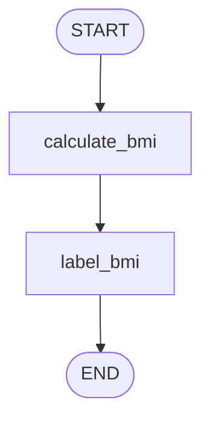

# Topic 1: Linear State Passing Engine (BMI Workflow)

This directory translates `1_bmi_workflow.ipynb` into a production-ready module demonstrating immutable dictionary-based state mutations in LangGraph.

---

## 🧠 Architectural Topology



### Core Principles Demonstrated
1. **`TypedDict` Schema Integration**: State keys define clear programmatic contracts across all subsequent node actions.
2. **Sequential Flow Execution**: Linear control flow passing the entire execution envelope along a singular path.
3. **Dictionary Subset Overwrites**: Returning a key-value mapping automatically overrides previous values for those keys inside the master state graph.

---

## 🚀 Execution Guide

Run the self-contained state machine locally to test static graph compilation and node processing steps:

```bash
# Execute local typed verification script
/home/divyansh-rawat/Agentic-AI/venv/bin/python3 bmi_workflow.py
```
