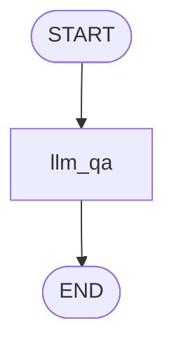

# Topic 2: Simple LLM Orchestration Engine

This folder contains a production-grade adaptation of `2_simple_llm_workflow.ipynb`. It shows how to embed generative language models directly into graph processing tasks.

---

## 📐 Graph Execution Design



### Core Architecture Highlights
* **Env Wrapping**: Securing runtime dependencies via local `.env` evaluation workflows before instantiating `langchain_openai` class objects.
* **String Context Mutation**: The graph node receives an input state message, appends task instruction context, and maps the model's textual completion directly back into the dictionary state output.

---

## 🛠 Prerequisites

Ensure you have configured a valid `OPENAI_API_KEY` inside your root `.env` config file.

```bash
# Execute local evaluation flow
/home/divyansh-rawat/Agentic-AI/venv/bin/python3 simple_llm_workflow.py
```
