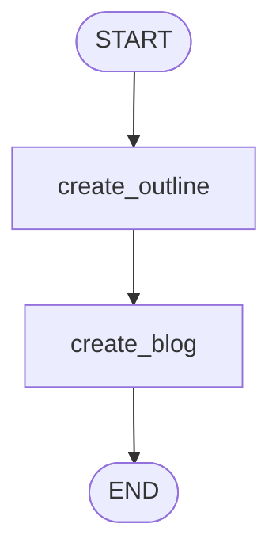

# Topic 3: Multi-Stage Prompt Chaining Engine

This topic contains an advanced implementation of `3_prompt_chaining.ipynb`. It shows how to build continuous pipeline flows where downstream generation tasks depend strictly on the synthesized contextual outputs of previous nodes.

---

## 🔗 Topology Flow



### Architectural Sequence
1. **Initial Trigger Payload**: The workflow receives an initial state object containing just a Target `title` string key.
2. **Phase 1: Structure Synthesis (`create_outline`)**: The graph formats a prompt instructing the language model to generate a rich markdown outline for the provided title string.
3. **Phase 2: Content Expansion (`create_blog`)**: The final generation node reads both the source `title` and synthesized `outline` from the shared state envelope to draft a highly structured, comprehensive content body.

> [!TIP]
> Prompt chaining optimizes LLM output quality by breaking monolithic authoring tasks into distinct logical planning and execution stages.

---

## 🚀 Execution Instructions

```bash
# Execute local evaluation flow
/home/divyansh-rawat/Agentic-AI/venv/bin/python3 prompt_chaining.py
```
