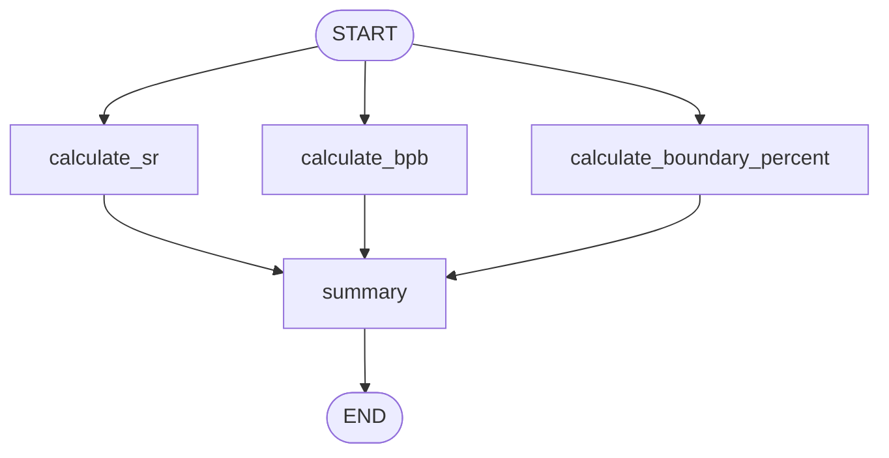

# Topic 4: Parallel Processing Fork-Join Graph (Batsman Workflow)

This folder implements a highly structured, parallel metrics computation graph translating `4_batsman_workflow.ipynb`. It shows how LangGraph orchestrates concurrent execution paths branching out from common entry points.

---

## 🔀 Concurrency Control Topology



### Architectural Deep Dive
1. **Parallel Execution Forks**: Multiple functional nodes (`calculate_sr`, `calculate_bpb`, `calculate_boundary_percent`) register inbound edges mapped directly to the `START` target. When compiled, LangGraph automatically executes these pathways concurrently to optimize runtime latency.
2. **Synchronization Barriers (Join Phase)**: All three independent metrics streams converge downstream onto the `summary` node. The framework guarantees that the aggregation node functions smoothly over the unified state produced by the parallel step.

---

## 📦 Executable Target

```bash
# Execute local parallel processing graph
/home/divyansh-rawat/Agentic-AI/venv/bin/python3 batsman_workflow.py
```
