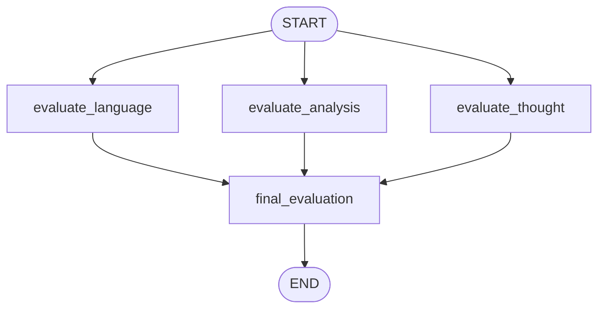

# Topic 5: Multi-Dimensional Evaluation Engine (UPSC Essay Workflow)

This folder contains a production implementation of `5_UPSC_essay_workflow.ipynb`. It shows advanced pattern orchestration using **Custom State Reducers** and **Structured Output Validation** to run multi-agent evaluations concurrently.

---

## 🔬 Architectural Diagram



### Critical Patterns Demonstrated
1. **Custom List Reduction (`operator.add`)**: 
   Standard keys override state values. However, configuring `individual_scores: Annotated[list[int], operator.add]` instructs LangGraph to **append** newly returned score elements to the shared array. This allows parallel execution nodes to safely emit sub-metrics without race conditions or array overwrites.
2. **Pydantic Model Enforcing (`with_structured_output`)**:
   Guarantees all output evaluations conform exactly to rigorous typing criteria (`EvaluationSchema`) mapping explicit JSON fields.
3. **Consensus Aggregation**:
   Converges distinct parallel critiques to compute overall performance metrics and structured review envelopes smoothly.

---

## 📦 Run Target Locally

Ensure your `.env` configuration contains an active `OPENAI_API_KEY`.

```bash
# Execute local evaluation workflow
/home/divyansh-rawat/Agentic-AI/venv/bin/python3 upsc_essay_workflow.py
```
