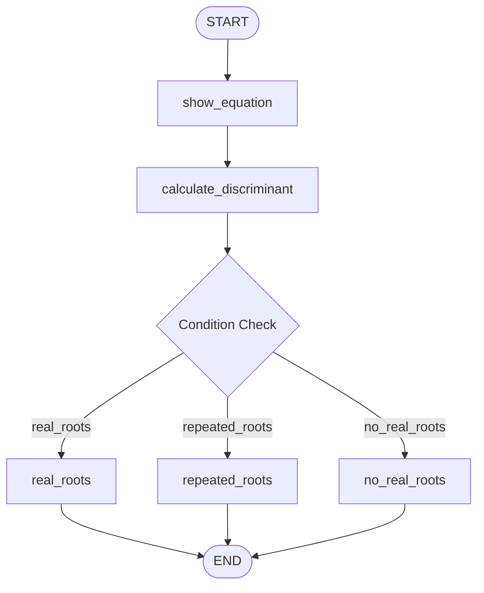

# Topic 6: Dynamic Conditional Router Engine (Quadratic Workflow)

This directory contains a production implementation of `6_quadratic_equation_workflow.ipynb`. It shows how to use **Conditional Routing Edges** in LangGraph to dynamically branch execution pathways based on intermediate state computations.

---

## 🛣 Decision Logic Topology



### Routing Mechanics
1. **Upstream Calculations**: The flow processes input coefficients ($a, b, c$) to derive a `discriminant` metric ($b^2 - 4ac$).
2. **Router Interception**: The `add_conditional_edges` construct binds a custom routing handler (`check_condition`) to the source node output.
3. **Literal Mapping**: The router returns explicit literal strings targeting target downstream nodes based on mathematical criteria ($D > 0, D = 0, D < 0$).

---

## 🚀 Execution Guide

Run the mathematical conditional router locally to test explicit path triggers:

```bash
# Execute local evaluation flow
/home/divyansh-rawat/Agentic-AI/venv/bin/python3 quadratic_workflow.py
```
