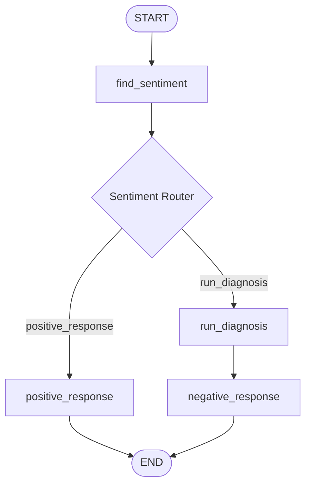

# Topic 7: Contextual Routing Automation (Review Reply Workflow)

This folder translates `7_review_reply_workflow.ipynb` into a highly robust customer support agent. It demonstrates **Multi-Schema Structured Output Validation** and **Sentiment-Driven Conditional Routing** in LangGraph.

---

## 🧭 Pipeline Flow Architecture



### Advanced Patterns Implemented
1. **Dual Pydantic Validators**:
   * `SentimentSchema`: Classifies raw review text into binary literals (`positive` / `negative`).
   * `DiagnosisSchema`: Extracts granular multi-dimensional metadata (`issue_type`, `tone`, `urgency`) from critical product feedback.
2. **Contextual Edge Switching**:
   Dynamically forwards positive feedback directly to gratitude generation tasks, while routing negative reviews through diagnostic parsing stages before drafting highly customized support solutions.

---

## 🛠 Running the Support Engine

Configure an active `OPENAI_API_KEY` inside your root `.env` configuration file before running.

```bash
# Execute local evaluation pipeline
/home/divyansh-rawat/Agentic-AI/venv/bin/python3 review_reply.py
```
