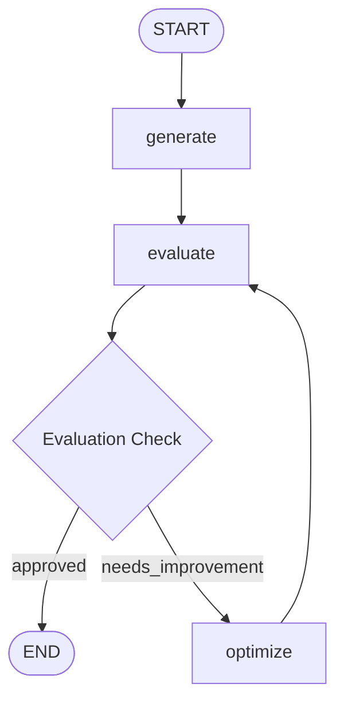

# Topic 8: Cyclical Optimization Pipeline (X Post Generator)

This directory contains a production-grade implementation of `8_X_post_generator.ipynb`. It shows how to design **Cyclical Evaluator-Optimizer Topologies** using state iteration counters and custom list reducers to draft viral social content.

---

## 🔄 Self-Correction Optimization Loop



### Advanced Patterns Implemented
1. **Cyclical State Routing**:
   Unlike simple directed acyclic graphs (DAGs), this workflow creates a deliberate loop (`optimize` $\rightarrow$ `evaluate` $\rightarrow$ `optimize`) allowing generation models to iteratively refine outputs based on concrete criticism until performance thresholds or iteration caps are satisfied.
2. **History Reducers (`operator.add`)**:
   Tracks complete audit histories across generation attempts by appending text updates to `tweet_history` and `feedback_history` list containers instead of overwriting intermediate states.
3. **Structured Critic Gatekeeper**:
   Enforces rigorous programmatic standards (`TweetEvaluation` Pydantic models) to eliminate undesirable formats (e.g., simplistic Q&A setups) automatically before approving final generation envelopes.

---

## 🚀 Execution Instructions

Ensure your `.env` configuration contains a valid `OPENAI_API_KEY`.

```bash
# Execute local cyclical optimization loop
/home/divyansh-rawat/Agentic-AI/venv/bin/python3 x_post_generator.py
```
