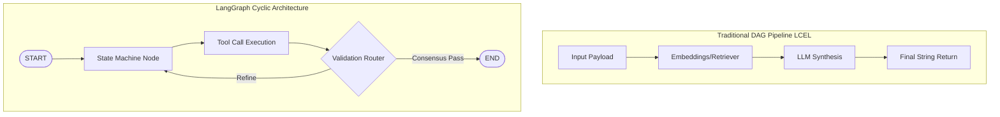

# Module 1: What is LangGraph? (Core Paradigm & Motivation)

LangGraph is an open-source framework developed by **LangChain AI** to construct cyclic, stateful, and persistent multi-agent architectures. It treats complex LLM logic as a highly controllable, observable **State Machine**.

---

## 🔍 Conceptual Deep-Dive & Core Motivation

Modern LLM applications scale beyond zero-shot generations. When building enterprise applications, systems require:
1. **Resilience & Self-Correction**: If a tool fails or outputs malformed structures, the system must loop back and trigger fallback reasoning paths.
2. **State Retention**: Keeping absolute track of shared memory, execution thread audit histories, and message queues across distributed processing tasks.
3. **Controllable Autonomy**: Directing deterministic routing logic to interleave with probabilistic semantic generations safely.

### Framework Visual Architecture

---

## 🆚 Comparative Execution Paradigms

| Dimension | LangChain Expression Language (LCEL) | LangGraph Orchestration Framework |
| :--- | :--- | :--- |
| **Topology Type** | Directed Acyclic Graphs (DAGs) | Stateful Cyclic Networks & Subgraphs |
| **Data Mutability** | Transient localized buffers | Global immutable typed dictionary schemas |
| **Execution Horizon**| Single synchronous pipeline trigger | Continuous state loop persistence across Supersteps |
| **Recovery Bounds** | Try/Catch wrappers | Native State Checkpoints supporting Time Travel |

---

## 💻 Technical Implementations Covered

The accompanying `what_is_langgraph.py` script implements two complete, executable canonical examples:
* **Example 1**: Emulating a linear static chain vs. building a robust stateful processing node pipeline. Demonstrates absolute state persistence across execution tasks.
* **Example 2**: Designing a recursive, self-correcting agent loop that iterates dynamically until a precise programmatic condition is triggered.

> [!IMPORTANT]
> Execute the provided demonstration module locally to verify static graph compilation properties and state variable updates directly in your console.
