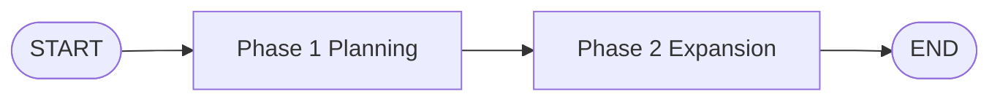
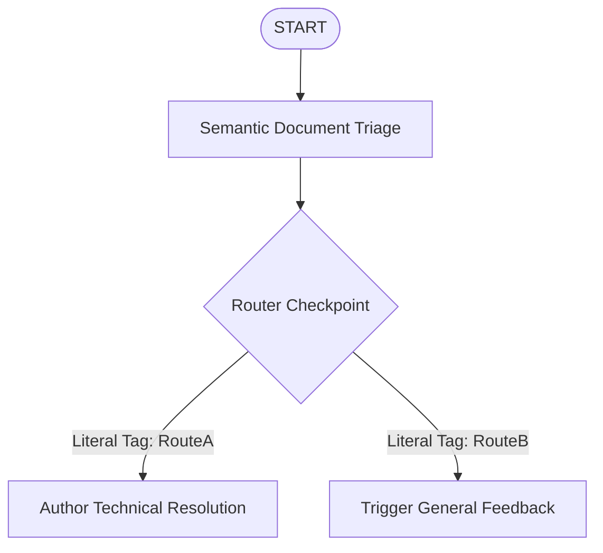
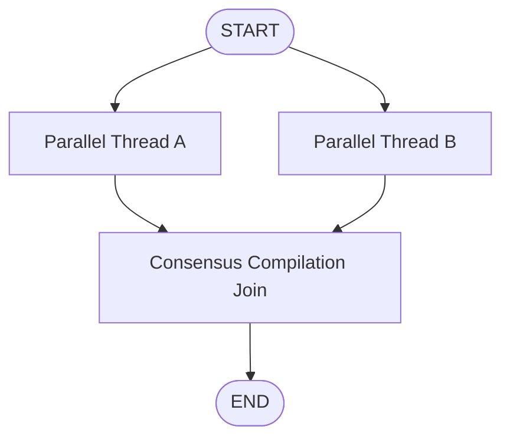

# Module 2: LLM Workflows & Core Orchestration Topologies

LangGraph acts as a programmable compiler for complex multi-stage agentic applications. Depending on computational bounds, developers map control flow logic directly onto explicit design topologies.

---

## 📐 Detailed Breakdown of Structural Topologies

### 1. Prompt Chaining (Multi-Stage Data Passing)
Each phase formats target instructions utilizing specific variables or metadata blocks generated by upstream nodes.
* **Typing Contract**: Linear additive string payload overrides.
* **Visual Topology**:

### 2. Dynamic Router Interception
Evaluates intermediate payload state variables to steer downstream execution logic along entirely independent processing tracks based on classification parameters.
* **Typing Contract**: Scalar conditional literal mappings.
* **Visual Topology**:

### 3. Concurrency Subgraphs (Fan-Out / Fan-In)
Splits execution channels to run independent scoring models or tool execution processes simultaneously, converging downstream onto a final consensus compilation target.
* **Typing Contract**: Custom reducer keys (`operator.add`) avoiding array clobbering.
* **Visual Topology**:

---

## 💻 Technical Implementations Covered

The accompanying `llm_workflows.py` module demonstrates two distinct, functional orchestration examples:
* **Example 1**: Implements a complete **Prompt Chaining Sequence** where an outline planner constructs structural markdown maps before forwarding them downstream to expand into finalized content bodies.
* **Example 2**: Implements a **Dynamic Semantic Router Pipeline** that evaluates user issue classifications to trigger distinct functional processing routines dynamically.

> [!TIP]
> Executing `llm_workflows.py` showcases real-time dictionary subsets updating persistent state blocks inside isolated node boundaries.
