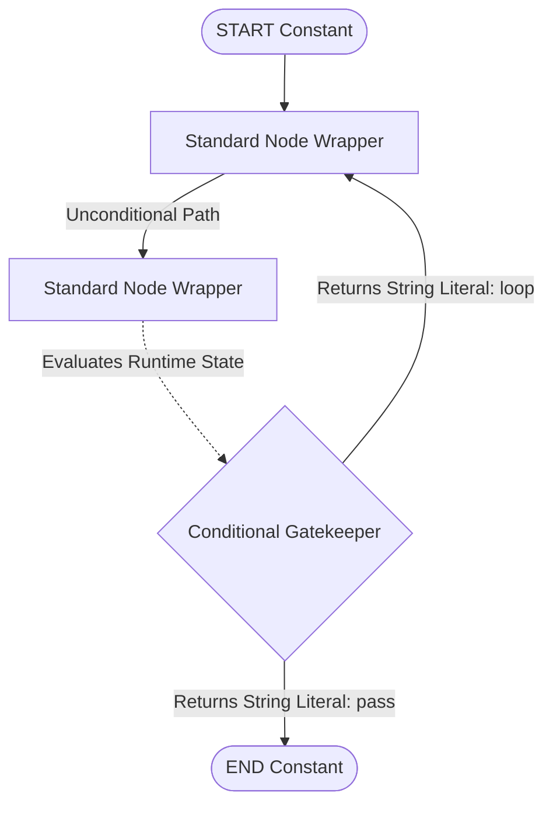

# Module 3: Graphs, Nodes, and Edges (Programmatic Foundations)

LangGraph translates application logic into strict object graphs. Programs construct instances of the `StateGraph` object, encapsulate runtime transformations inside **Functional Nodes**, and route execution paths using **Explicit Edges**.

---

## 🧱 Granular Programmatic Foundations

### 1. The Container Class (`StateGraph`)
The master wrapper that registers state types. Initializing `StateGraph(StateSchema)` ensures that subsequent compilation runs validate internal payload parameters against structural contracts automatically.

### 2. Functional Transformation Nodes
A node represents an isolated computation envelope. In Python, nodes are standard functions or callable class instances mapping an inbound state dictionary argument to a returned subset update dictionary payload.

```python
# Elite python typing contract for an atomic processing node
def computational_node(state: dict) -> dict:
    # 1. Access master shared memory dictionary parameters
    current_runs = state.get("runs", 0)
    
    # 2. Return subset key updates to trigger overwrite state cycles
    return {"runs": current_runs + 10}
```

### 3. Traversal Directives (Edges)
Edges define exact runtime paths. LangGraph provides two core routing constructs:
* **Standard Edges (`add_edge`)**: Establishes unconditional single-path execution paths directly between two discrete nodes.
* **Conditional Edges (`add_conditional_edges`)**: Binds an inline evaluation routing function to a source node output. The router evaluates state variables to return specific literal strings mapped targeting target downstream nodes.

---

## 🧭 Visual Execution Pathways



---

## 💻 Technical Implementations Covered

The accompanying `graphs_nodes_and_edges.py` module implements two complete runnable examples:
* **Example 1**: Implements a highly functional **Standard Edge Processing Sequence** demonstrating sequential deterministic message passing layers.
* **Example 2**: Implements an advanced **Conditional Router Pipeline** mapping runtime variable thresholds to alternate literal routing strings smoothly.

> [!WARNING]
> Unhandled literal string returns emitted by conditional switching handlers will cause compiled graph application invocation exceptions. Ensure absolute 1:1 mapping consistency.
