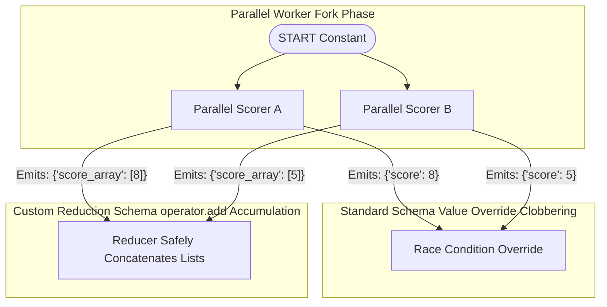

# Module 5: Reducers (Custom Aggregation & Parallel State Safety)

While default dictionary schemas implement value override/replacement behaviors, advanced graph runtimes require cumulative state operations. **Custom State Reducers** guide the framework engine on how to safely merge concurrent updates returned by independent parallel nodes.

---

## 🛡️ Resolving Concurrency Race Conditions

During a parallel execution phase (Fan-Out), multiple independent nodes process identical copies of the graph state simultaneously. If those concurrent nodes return scalar values targeting the same standard dictionary key, standard overwrite semantics cause **Value Clobbering**—only the return from the final terminating node is retained in memory.

### Visual Flow Comparison



---

## 🧬 Annotated List Reducers (`operator.add`)

To append parallel array payloads cleanly, developers use Python's `operator.add` function inside standard typing schemas via `typing.Annotated`.

```python
import operator
from typing import TypedDict, Annotated

class ThreadState(TypedDict):
    # Standard string key: Implements override behaviors
    session_id: str
    
    # Custom Reducer Key: Concatenates returned list sequences safely
    parallel_metrics: Annotated[list[int], operator.add]
```

---

## 💻 Technical Implementations Covered

The accompanying `reducers.py` module implements two complete executable examples demonstrating custom reduction:
* **Example 1**: Implements a complete **Parallel Fan-Out / Fan-In Topology** leveraging `operator.add` array reducers to safely compile parallel thread evaluations into a single global data list.
* **Example 2**: Implements a **Custom Mathematical Reduction Function** demonstrating arbitrary numerical calculation mapping inside custom reducer logic blocks.
