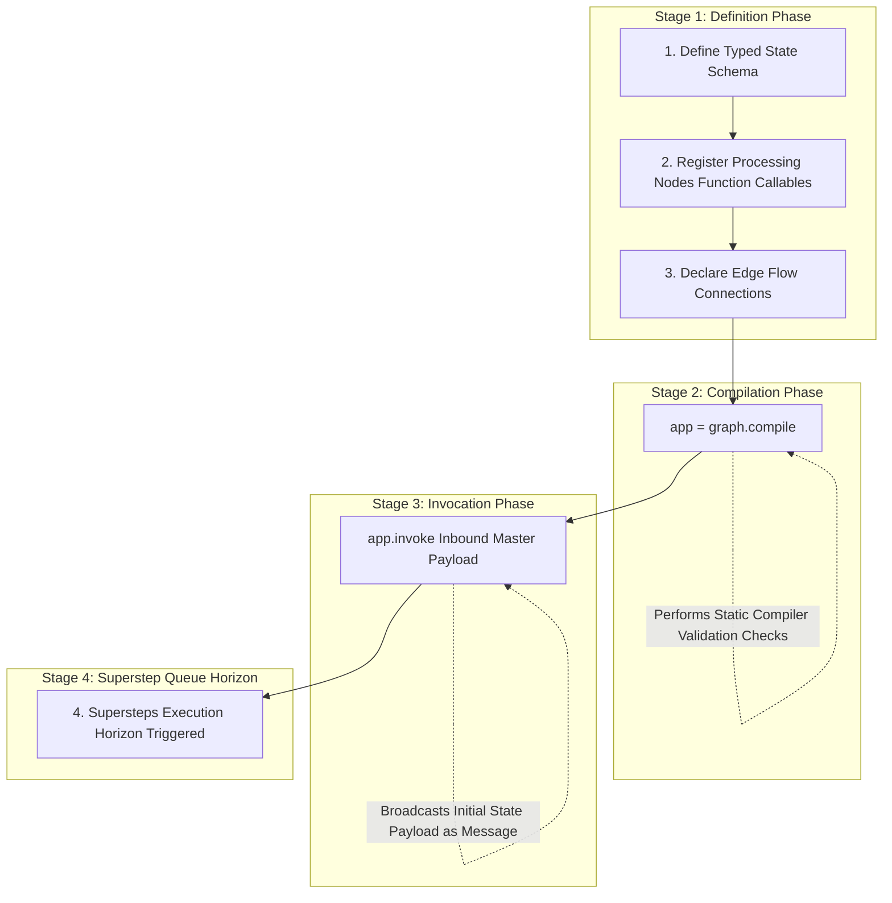
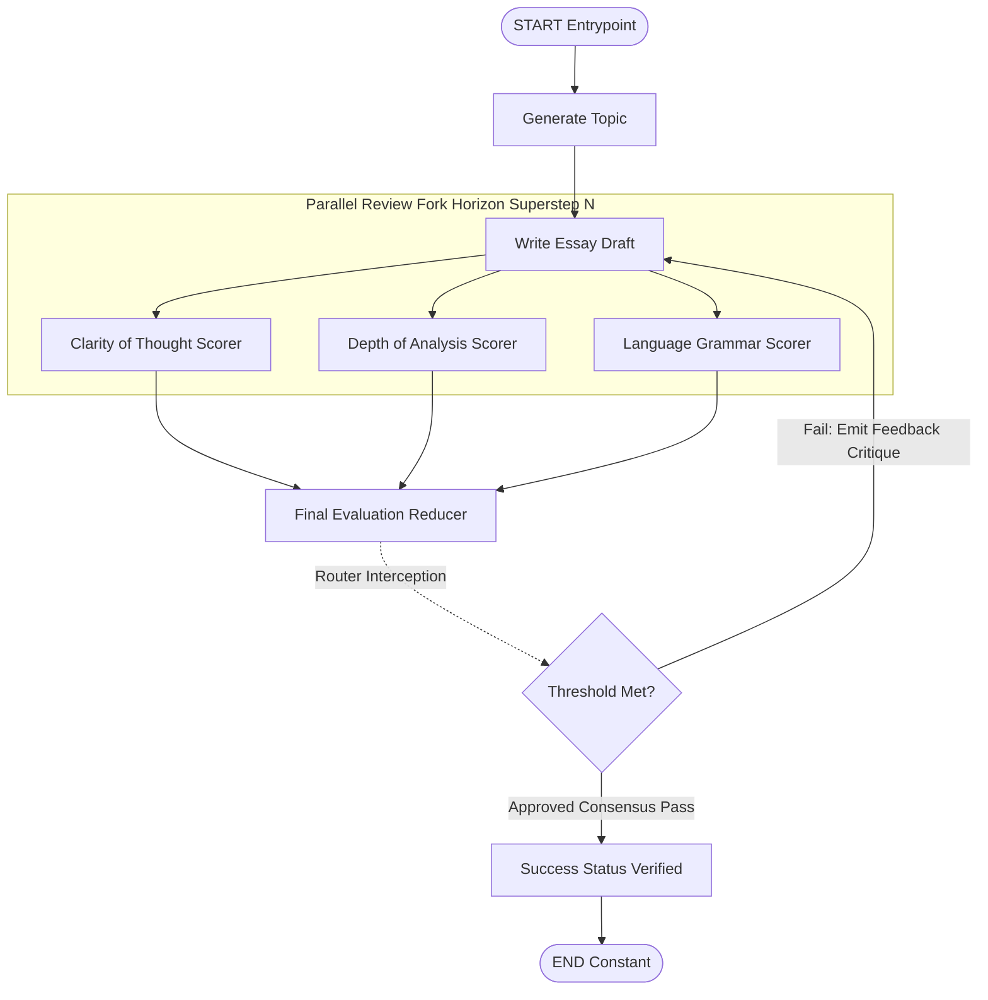

# Module 6: LangGraph Execution Model (Lifecycle & Runtime Mechanics)

To successfully design stateful autonomous agents, developers must master the absolute sequential lifecycle of LangGraph applications. The underlying framework execution relies on a clear progression from structural definition to message-passing iterations within synchronous boundaries known as **Supersteps**.

---

## 🏛️ The Complete Lifecycle Architecture

As illustrated in your core curriculum references, the orchestration model flows through four explicit architectural stages:

### 1. Graph Definition
You define the base structural topology components:
* **The State Schema**: The structural interface payload container defined via `TypedDict` or Pydantic.
* **Nodes**: Atomic Python functional code blocks or callables that accept state inputs and emit update dictionary subsets.
* **Edges**: Explicit directed connectors declaring routing paths between registered target nodes.

### 2. Compilation
You execute the compiler wrapper calling `.compile()` directly on the target `StateGraph` object. 
* **Mechanics**: Validates the network structure natively, verifies edge routing tags map exactly to registered functional nodes, and prepares internal serialization structures.

### 3. Invocation
You trigger the runtime engine calling `.invoke(initial_state)`.
* **Mechanics**: LangGraph reads the input payload dict and broadcasts it as an inbound initialization **message queue** to trigger the starting entry node(s).

### 4. Supersteps Begin
The computational loop starts processing synchronous turn blocks. During an active Superstep:
* All active target nodes mapped for execution receive identical input copies of the shared state dictionary simultaneously.
* Isolated nodes process operations returning localized dictionary overrides or reducers.
* The framework waits for all parallel operations within the Superstep interval to complete before merging state subsets and computing subsequent routing branches.

---

## 🔄 Case Study: Multi-Agent Essay Optimization Engine

The diagram below reflects the canonical advanced workflow topology tracking essay review iterations across sequential Supersteps:

---

## 💻 Technical Implementations Covered

Review the accompanying `langgraph_execution_model.py` module to execute two functional scenarios mapping these absolute lifecycle mechanics:
* **Example 1**: Emulates **Superstep Synchronization Boundaries** proving parallel nodes read identical snapshots simultaneously without clobbering unmutated keys.
* **Example 2**: Attaches persistent `MemorySaver` checkpointer layers during the compilation stage to serialize, view, and resume continuous conversation threads smoothly.
