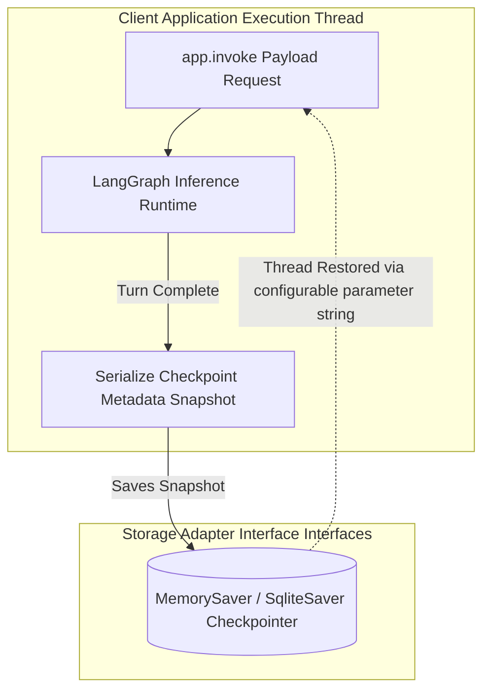

# Module 7: Persistence & Checkpointing (Memory Mechanics & Time Travel)

To build enterprise-grade autonomous agents capable of interacting across multiple decoupled user interfaces, developers must integrate stateful **Persistence Checkpointers**. LangGraph decouples pure execution logic from long-term memory access layers, enabling continuous multi-turn thread tracking, human interruption barriers, and absolute runtime debug audibility.

---

## 🏛️ Low-Level Checkpoint Architecture

LangGraph checkpointing operates on discrete synchronization boundaries known as **Supersteps**. At the completion of every complete Superstep processing horizon, the running engine automatically serializes the global state dictionary payload and stores it securely inside an attached memory saver adapter.

---

## 🌍 Real-Life Enterprise Situations Covered

### Situation 1: Multi-Session Customer Ticket Persistence
* **Context**: A financial support application communicates with web UI browser applications. A customer submits billing records but disconnects due to device battery failure mid-session.
* **Mechanism**: By mapping explicit thread access dictionaries (`{"configurable": {"thread_id": "support_tx_881"}}`), the incoming server request retrieves the exact unmutated graph state automatically, bypassing re-evaluation overhead.

### Situation 2: High-Risk Transaction Approvals & History Forking
* **Context**: An automated billing execution node processes direct refund transactions targeting client bank gateways.
* **Mechanism**: By configuring compilation interrupt barriers (`interrupt_before=["refund_node"]`), execution halts cleanly mid-stream. Administrative operators inspect saved low-level checkpointer tuples, assert payload validity, or fork alternate states entirely (**Time Travel**).

---

## 💾 Storage Implementations Overview

| Checkpoint Class | Target Deployment Context | Technical Capabilities |
| :--- | :--- | :--- |
| **`MemorySaver`** | Local unit validation & development loops | High-speed, transient thread memory caching mapped within Python process memory. |
| **`SqliteSaver`** | Embedded desktop UI apps & edge deployments | Synchronous SQLite persistent database tracking mapping state records to file clusters. |
| **`AsyncPostgresSaver`**| Enterprise microservices architectures | High-throughput connection pooling running natively across asynchronous web workers. |

---

## 💻 Technical Implementations Covered

The accompanying `persistence_and_checkpointing.py` module applies these patterns across two comprehensive scenarios complete with exhaustive docstring annotations:
* **Example 1**: Implements a complete **Multi-Turn Customer Ticket Thread** leveraging `MemorySaver` checkpointers to prove state retention across disconnected execution invocations targeting shared connection configurations.
* **Example 2**: Simulates a **Financial Transaction Approval Checkpoint** demonstrating compile-time thread halting alongside low-level execution history auditing.
