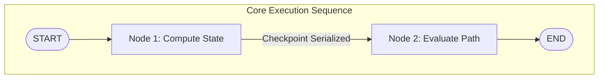

# Module 7: Persistence in LangGraph (Memory Mechanics & Time Travel)

---

## 📖 What is Persistence?
**Persistence in LangGraph refers to the ability to save and restore the state of a workflow over time.** 

By default, state graph execution logic runs entirely in ephemeral process memory. Integrating persistent checkpointers decouples processing nodes from short-term context loss, allowing workflows to preserve historical tracking metrics safely across decoupled superstep execution turns.



---

## ⚙️ How to implement Persistence
Implementing persistence requires instantiating a target storage saver adapter and injecting it as an explicit parameter during the graph compilation phase:

```python
from langgraph.checkpoint.memory import MemorySaver

# 1. Instantiate the memory checkpointer engine
checkpointer = MemorySaver()

# 2. Bind directly during graph compilation
persistent_app = graph.compile(checkpointer=checkpointer)
```

---

## 💻 Code
The full executable counterpart is physically persisted at `persistence_and_checkpointing.py` (`/home/divyansh-rawat/Agentic-AI/langgraph_topics/07_Persistence_and_Checkpointing/persistence_and_checkpointing.py`). It executes end-to-end demonstrations proving thread state retention across detached script calls.

---

## 🧵 Threads in Persistence
To allow multiple users or detached browser sessions to interface with the same underlying graph logic concurrently without cross-contamination, persistent state execution routes are explicitly indexed using unique session strings called **Threads**.

* **Configurable Keys**: Developers pass an explicit dictionary config containing targeted thread parameters during runtime invocations:
  ```python
  thread_config = {"configurable": {"thread_id": "session_user_991"}}
  app.invoke(input_data, config=thread_config)
  ```
* **Thread Partitioning**: The underlying checkpointer partitions state records isolation tables matching the passed string literal, ensuring user A's state updates never override user B's context buffers.

---

## 🌟 Benefits of Persistence

Integrating checkpointers unlocks four fundamental technical capabilities powering production agentic software:

### 1. Short Term Memory
* Retains exact conversational structures and dictionary keys across multiple sequential turns, allowing agents to process sliding context buffers naturally without requiring manual array re-injections.

### 2. Fault Tolerance
* Automatically logs exact superstep inputs and processing state variables. If a downstream API gateway triggers a transient connection failure, execution re-initializes cleanly starting directly from the last valid checkpoint block.

### 3. HITL (Human in the Loop)
* Enables compilation-level runtime pauses (`interrupt_before=["high_risk_node"]`). Execution halts natively mid-stream, allowing administrative operators to inspect internal parameters or inject dynamic feedback strings manually.

### 4. Time Travel
* Unlocks complete read/write audit access over historical state arrays (`app.get_state_history(config)`). Developers can rewind execution pointers to previous state snapshots, branch alternate conversational outcomes, or edit problematic variable choices on the fly.
