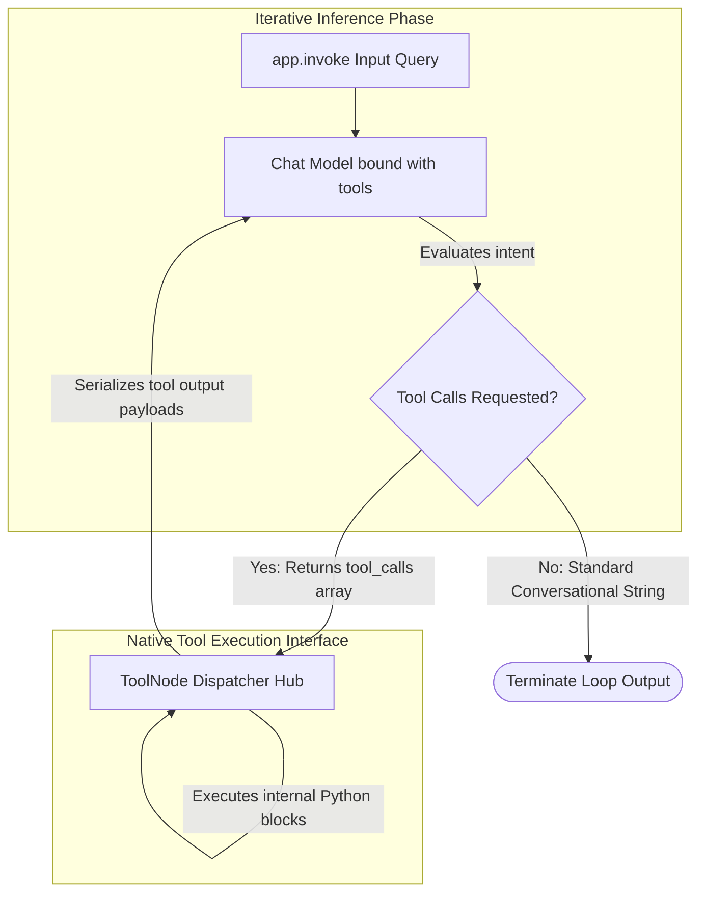

# Module 8: Tool Calling Agents (Native Dispatch & Execution Hubs)

To empower Large Language Models to interact with external enterprise environments (databases, APIs, calculators), developers implement **Tool Calling Architectures**. LangGraph natively integrates function calling wrappers to dynamically feed tool arguments directly into compiled processing nodes.

---

## ⚙️ The Native Tool Dispatch Lifecycle

### 1. Function Binding (`.bind_tools()`)
Developers annotate Python utility definitions with standard Pydantic type hints. Calling `llm.bind_tools([func_a, func_b])` compiles these definitions into strict JSON schema arrays broadcasted to the underlying chat inference engine.

### 2. Automated Dispatch Hubs (`ToolNode`)
Rather than manually authoring routing switches to evaluate model outputs, developers drop in prebuilt execution hubs like `ToolNode`. 
* **Mechanics**: Intercepts message queues containing tool invocations, invokes target underlying functions locally, and appends serialized results back onto active execution dictionaries.

---

## 🛠️ Real-Life Operational Scenarios

### Scenario 1: Automated Inventory Calculation
* **Context**: A supply chain agent fields dynamic restock requests.
* **Mechanism**: The model evaluates raw input queries, extracts quantity integers, and passes them as tool payloads to trigger local SQL database multiplier utilities.

### Scenario 2: Secure API Query Validation
* **Context**: A support assistant parses network diagnostics.
* **Mechanism**: Binds rigid Pydantic schemas directly to downstream utilities to enforce argument formats before executing external web calls.

---

## 💻 Technical Implementations Covered

Review `tool_calling_agents.py` to examine complete executable code demonstrating function-bound models complete with rich docstring documentation:
* **Example 1**: Implements a complete **Dynamic Calculator Tool Agent** proving automated argument injection and recursive loop evaluation.
* **Example 2**: Simulates a **Mock Pydantic Parameter Validator** demonstrating strict type enforcement targeting external function boundaries.
