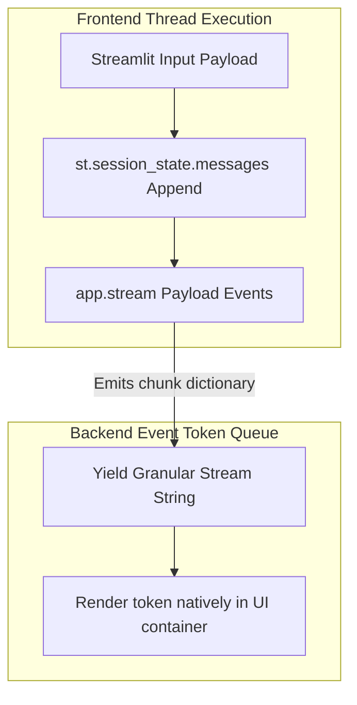

# Module 9: Chatbot UI Integration, Streaming & Session Resumption

To transition agentic logic from local consoles to production web browser environments, developers integrate frameworks like **Streamlit** alongside event **Streaming APIs**. This module details the core mechanisms powering interactive multi-turn threads, chunk-by-chunk stream updates, and persistent connection resumes.

---

## 🖥️ Streamlit UI Integration Architecture

Backend state graphs are compiled with explicit Persistent Checkpointers (`MemorySaver` or databases) and wrapped inside persistent session threads (`st.session_state`).

---

## 🌊 Streaming Granular Execution Tokens

Rather than blocking thread execution until a complete Superstep completes, calling `app.stream()` or `app.astream_events()` exposes granular node progression states in real-time.
* **Mechanics**: Intercepts internal model buffers directly to capture output delta tokens as they are emitted by the LLM inference provider.

---

## 🔄 Resuming Active Chat Threads

To replicate production session switching capabilities (e.g., ChatGPT's sidebar history panel), developers parameterize incoming executions using persistent thread dictionaries.
* **Configurable String**: Passing `{"configurable": {"thread_id": selected_uuid}}` queries underlying storage adapters to re-initialize execution pointers exactly where the target user left off.

---

## 💻 Technical Implementations Covered

Review `chatbot_ui_and_streaming.py` for fully commented source demonstrations:
* **Example 1**: Simulates continuous stream token unpacking targeting dynamic UI components.
* **Example 2**: Implements a dedicated multi-thread conversation manager switching contextual memory boundaries natively.
