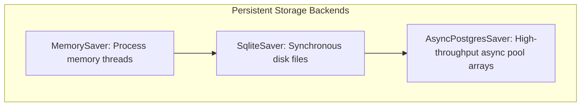

# Module 10: Relational Database Checkpointers (SQLite & Async Postgres)

To transition persistent state tracking from ephemeral process memory to persistent long-term database tables, developers implement relational storage backends. LangGraph decouples pure execution flows from storage logic using drop-in database persistent checkpointer interfaces.

---

## 💾 Storage Backends Lifecycle Comparison

### 1. `SqliteSaver` (Local Embedded Apps)
* **Mechanics**: Serializes superstep thread execution payloads directly into flat `.db` SQLite files. Ideal for local development, Streamlit desktop implementations, and edge offline client logic.

### 2. `AsyncPostgresSaver` (Production Microservices)
* **Mechanics**: Implements robust asynchronous connection pools optimized for continuous high-throughput web service clusters. Provides native JSONB record indexing to parse stored dictionary configurations rapidly.

---

## 💻 Technical Implementations Covered

Review `database_checkpointers.py` for fully commented source demonstrations complete with exhaustive docstrings:
* **Example 1**: Configures persistent local database checkpointers simulating thread state file serialization.
* **Example 2**: Documents drop-in connection setup patterns targeting remote asynchronous storage targets.
