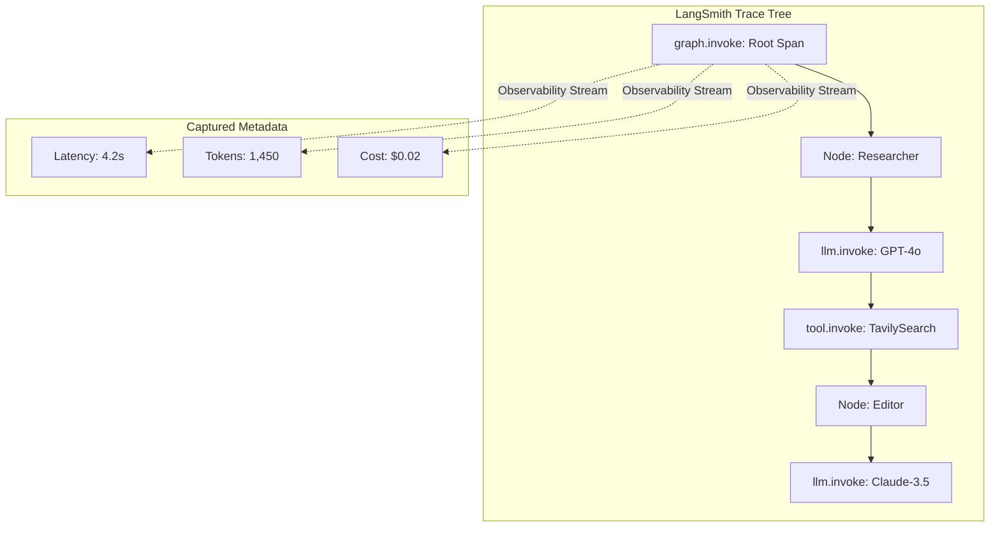

# Module 11: Observability in LangGraph & LangSmith (Tracing, Debugging & Performance)

Observability is the bedrock of production-grade agentic systems. Unlike traditional software, LLM-driven applications are non-deterministic. **LangSmith** provides a high-density tracing environment that allows developers to peer into the "inner reasoning" of their graphs, tracking everything from token counts to complex state mutations.

---

##  The pillars of Observability

### 1. Systematic Tracing (Spans & Runs)
A **Trace** represents the complete end-to-end execution of a single request. It is structured as a tree of **Runs** or **Spans**:
*   **Root Run**: The initial `graph.invoke()` call.
*   **Child Runs**: Discrete node executions, LLM generations, tool calls, and retriever fetches.

### 2. High-Density Metrics
LangSmith automatically captures critical performance indicators (KPIs) for every step in the graph:
*   **Latency**: Exact duration of each node execution, allowing for bottleneck identification.
*   **Token Usage**: Detailed breakdown of Prompt, Completion, and Total tokens.
*   **Cost Estimation**: Rolling cost totals based on model-specific pricing tiers.

### 3. State Mutation Tracking
Unique to LangGraph, observability allows you to see exactly how the `State` dictionary evolved after each node. You can compare the **Inbound State** with the **Outbound Update** to verify logic correctness.

---

##  Environment Configuration

To enable observability, you only need to configure the standard LangChain environment variables. No code changes are required in the graph definition itself.

```bash
# Enable the tracing engine
export LANGCHAIN_TRACING_V2=true

# Authenticate with LangSmith
export LANGCHAIN_API_KEY="ls__your_key_here"

# Group traces into logical projects
export LANGCHAIN_PROJECT="Agentic_AI_Mastery"
```

---

##  Visual Execution Tracing



---

## Technical Implementations Covered

The accompanying `observability_and_langsmith.py` module demonstrates:
*   **Example 1**: Enabling global tracing via environment hooks.
*   **Example 2**: Executing a stateful graph while monitoring real-time token usage and latency in the LangSmith UI.
*   **Example 3**: Attaching custom metadata and tags to traces for advanced filtering.

> [!TIP]
> Use the `metadata` parameter in `invoke()` to pass specific session IDs or user hashes. This makes production debugging significantly easier when filtering through thousands of traces.
