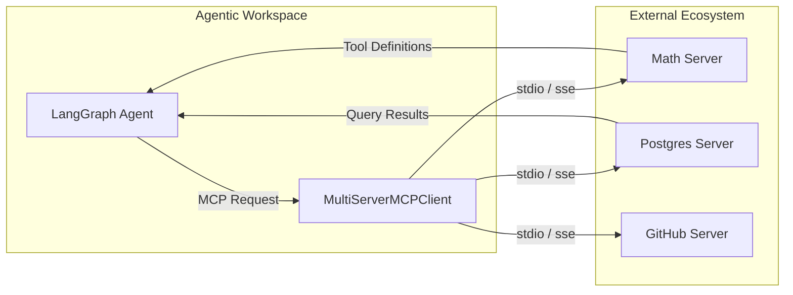

# Module 12: Model Context Protocol (MCP) Client Integration

The **Model Context Protocol (MCP)** is a revolutionary open standard designed to solve the "N×M integration problem" in agentic AI. Instead of writing custom connectors for every model and every data source, MCP provides a unified interface for models to securely access local and remote tools, files, and databases.

---

## 🏛️ Why MCP is Critical for Enterprise Agents

### 1. Unified Interface
Historically, developers had to write bespoke integration code for every API (Slack, GitHub, SQL, Notion). MCP standardizes these into a single protocol. If a service provides an MCP server, any MCP-compatible agent can use it immediately.

### 2. Security & Context Isolation
MCP servers act as secure gateways. Agents request specific context through the protocol, and the server executes the logic in its own environment. This prevents the LLM from having direct, unfettered access to sensitive infrastructure.

### 3. Model Agnosticism
Because MCP is a protocol, you can swap the underlying model (Claude, GPT-4o, Gemini) without changing your tool-calling logic. The model simply interfaces with the **MCP Client**, which talks to the **MCP Server**.

---

## 🔄 The MCP Architecture in LangGraph

In a LangGraph workflow, the graph acts as the **MCP Client**.

### Protocol Transports
*   **stdio**: Best for local tools. The client launches a child process and communicates via standard input/output.
*   **sse / http**: Best for remote or containerized tools. Communicates over Server-Sent Events or standard HTTP.

---

## 💻 Technical Implementations Covered

The accompanying `mcp_client_integration.py` module demonstrates:
*   **Example 1**: Initializing a `MultiServerMCPClient` with both `stdio` and `sse` transports.
*   **Example 2**: Dynamically fetching tools from multiple MCP servers and binding them to an LLM.
*   **Example 3**: Implementing an asynchronous LangGraph that routes between chat nodes and dynamic MCP tool nodes.

> [!IMPORTANT]
> When using `stdio` transport, ensure the `command` (e.g., `python3`, `node`) is available in your system path and the `args` point to valid server entry points.
