# Module 13: Agentic RAG & Vector Search (Stateful Retrieval Architectures)

Traditional Retrieval-Augmented Generation (RAG) is a static linear pipeline: **User Query -> Retrieval -> Generation**. **Agentic RAG** transforms this into a dynamic, stateful graph where the model can evaluate retrieved context, decide to fetch more data, or route the query to different specialized indices based on runtime analysis.

---

## 🏛️ From Static RAG to Agentic RAG

### 1. The Retrieval Quality Bottleneck
In standard RAG, if the retriever fetches irrelevant documents (noise), the LLM will likely hallucinate or fail. Agentic RAG introduces **Reasoning Nodes** after retrieval to score the relevance of each document before passing it to the generator.

### 2. Multi-Index Routing
Instead of a single "catch-all" vector database, Agentic RAG uses a **Router Node** to evaluate the user's intent. The agent might decide to query:
*   **Technical Documentation Index** for coding questions.
*   **Internal Knowledge Base** for policy questions.
*   **Web Search (Tavily)** if the internal indices return zero high-relevance hits.

---

## 🧭 The Agentic RAG Lifecycle

```mermaid
graph TD
    S([START]) --> Router{Intent Router}
    Router -- "Internal" --> Vector[Vector DB Retrieval]
    Router -- "Global" --> Web[Tavily Web Search]
    
    Vector --> Eval{Relevance Scorer}
    Web --> Eval
    
    Eval -- "High Score" --> Gen[Generation Node]
    Eval -- "Low Score" --> Rewrite[Query Rewriter]
    
    Rewrite --> Router
    Gen --> END([END])
    
    style S fill:#0ea5e9,stroke:#38bdf8
    style END fill:#bc13fe,stroke:#a855f7
    style Router fill:#1e293b,stroke:#38bdf8
    style Eval fill:#1e293b,stroke:#38bdf8
```

### Key Components:
*   **Query Rewriter**: If retrieval fails, a specialized node "refines" the user's query to better match the vector space (HyDE, step-back prompting).
*   **Evaluator (Self-RAG)**: A node that checks if the generated answer actually reflects the retrieved context (hallucination check).

---

## ⚡ Vector Search Foundations

### 1. Embedding Models
The bridge between text and geometry. Models like `text-embedding-3-small` convert tokens into high-dimensional vectors where semantic similarity correlates with geometric proximity (Cosine Similarity).

### 2. Vector Stores (FAISS, Chroma, Pinecone)
Specialized databases optimized for **Nearest Neighbor** searches. Unlike SQL, which searches for exact matches, Vector Stores perform high-speed similarity scans across millions of document chunks.

---

## 💻 Technical Implementations Covered

The accompanying `agentic_rag.py` module demonstrates:
*   **Example 1**: Implementing a **Document Scorer** node that filters retrieval noise.
*   **Example 2**: Building a **Multi-Index Router** selecting between local FAISS and remote Web Search.
*   **Example 3**: A complete **Self-Correction Loop** where the agent rewrites its own query if relevance scores fall below a 70% threshold.

> [!NOTE]
> High-performance RAG requires careful **Chunking Strategies**. RecursiveCharacterTextSplitter with moderate overlap (150-200 tokens) is the enterprise standard for preserving context across chunk boundaries.
