# Module 14: Human-in-the-Loop (HITL) Supervision (Stateful Interruption & Resume)

In production agentic systems, especially those performing high-risk actions (monetary transfers, infrastructure changes, database deletions), autonomous execution must be tempered with human oversight. **Human-in-the-Loop (HITL)** is the architectural pattern that allows a graph to pause mid-stream, request human feedback, and resume only after explicit approval.

---

## 🏛️ The Mechanics of Interruption

### 1. Persistent Checkpointing (The Prerequisite)
HITL is only possible when the graph is **Persistent**. When an interrupt is triggered, the engine serializes the current `State` and instruction pointer into a database. The thread stays "suspended" until a resume command is received.

### 2. Static Interrupts (`interrupt_before` / `interrupt_after`)
These are configured during graph compilation. They act as "Security Checkpoints" at the node level:
*   **`interrupt_before`**: Halts execution *before* a specific node is invoked. Ideal for verifying inputs or approval of high-risk nodes.
*   **`interrupt_after`**: Halts execution *after* a node completes. Ideal for auditing the results of a node before moving to the next stage.

### 3. Dynamic Interrupts (`interrupt()` function)
Introduced in recent LangGraph versions, this allows for logic-driven pauses *inside* a node or tool. The agent can dynamically decide it needs human clarification based on runtime ambiguity.

---

## 🧭 The HITL Supervision Flow

```mermaid
graph TD
    S([START]) --> Chat[Chat Node: Reasoning]
    Chat -- "Proposes Action" --> Guard{Security Checkpoint}
    
    Guard -- "Pauses Superstep" --> DB[(Persistent Store)]
    DB -- "Awaiting Approval" --> Human((Human Admin))
    
    Human -- "Command(resume='yes')" --> Resume[Resume Execution]
    Resume --> Tool[Tool Node: High-Risk Action]
    Tool --> END([END])
    
    style S fill:#0ea5e9,stroke:#38bdf8
    style END fill:#bc13fe,stroke:#a855f7
    style Guard fill:#450a0a,stroke:#991b1b
    style Human fill:#065f46,stroke:#059669
```

---

## 🔄 Resuming with `Command(resume=...)`

When a human provides feedback, the developer uses the `Command` object to "jump-start" the paused execution.
*   **Simple Approval**: Passing a "yes" or "no" literal.
*   **State Override**: Passing a dictionary subset to "fix" a model's faulty decision before it proceeds.

---

## 💻 Technical Implementations Covered

The accompanying `hitl_supervision.py` module demonstrates:
*   **Example 1**: Using `interrupt_before` to pause a **Stock Purchase** agent.
*   **Example 2**: Using the dynamic `interrupt()` function inside a custom tool.
*   **Example 3**: Interrogating the `__interrupt__` payload to display human-readable prompts in the UI.

> [!CAUTION]
> Always use unique `thread_id` values when managing HITL. If multiple sessions share the same thread, human approvals could be misrouted to the wrong execution context.
