# Module 15: Subgraphs Orchestration (Encapsulation & Modular State Graphs)

As agentic systems grow in complexity, a single monolithic graph becomes difficult to maintain, debug, and reuse. **Subgraphs** are the architectural solution for modularity, allowing developers to encapsulate complete, independent `StateGraph` compilations as standalone functional nodes within a larger parent workflow.

---

## 🏛️ The Rationale for Subgraphs

### 1. Separation of Concerns
In a multi-agent system (e.g., Researcher + Writer), the internal logic of the "Researcher" (retrieval, scoring, re-ranking) is irrelevant to the "Writer". Subgraphs allow you to hide this internal complexity, exposing only the final output to the parent orchestrator.

### 2. Independent Scaling & Testing
Because a subgraph is just a compiled `StateGraph`, it can be unit-tested in isolation before being integrated. You can also swap out different subgraph implementations (e.g., swapping a GPT-4o Researcher for a Claude-3.5 Researcher) without modifying the parent graph's topology.

### 3. State Isolation vs. Shared State
*   **Independent State (Encapsulated)**: The subgraph has its own unique `TypedDict`. The parent node acts as a "bridge," mapping specific parent keys to subgraph inputs and vice-versa.
*   **Shared State**: The subgraph and parent share the same state schema. Updates made by the subgraph's nodes are automatically reflected in the parent's state.

---

## 🧭 Subgraph Communication Patterns

### Pattern A: The Bridge Mapping
The parent node invokes the compiled subgraph and returns a dictionary that matches the parent's state schema.

```mermaid
graph LR
    subgraph "Parent Graph"
        P_Start([START]) --> P_Node[Node: Process Data]
        P_Node --> Sub_Interface[Call Subgraph]
        Sub_Interface --> P_End([END])
    end

    subgraph "Encapsulated Subgraph"
        Sub_Interface --> S_Start([START])
        S_Start --> S1[Translate]
        S1 --> S2[Summarize]
        S2 --> S_End([END])
        S_End --> Sub_Interface
    end

    style P_Start fill:#0ea5e9,stroke:#38bdf8
    style Sub_Interface fill:#bc13fe,stroke:#a855f7
    style S1 fill:#1e293b,stroke:#334155
```

---

## 💻 Technical Implementations Covered

The accompanying `subgraphs_orchestration.py` module demonstrates:
*   **Example 1**: Defining an **Encapsulated Translation Subgraph** with its own local state.
*   **Example 2**: Building a **Parent Orchestrator** that delegates specific steps to the translation subgraph.
*   **Example 3**: Managing **Shared State Subgraphs** where multiple graphs operate on a unified data contract.

> [!TIP]
> When building subgraphs, treat them as "Black Boxes." The parent should only know about the **Input Schema** and **Output Schema**, never the internal nodes or edges of the subgraph.
