# Module 16: Memory Mechanics Deep Dive (Short-Term vs. Long-Term Agency)

A common misconception is that LLMs have memory. In reality, LLMs are stateless functions. "Memory" is an architectural simulation achieved by appending past interactions to the current context window or retrieving them from external storage. LangGraph provides two distinct layers of memory: **Short-Term (Thread-level)** and **Long-Term (Cross-thread)**.

---

## 🏛️ The Hierarchy of Agentic Memory

### 1. Short-Term Memory (The Thread State)
This is the immediate conversational context. In LangGraph, this is managed by the `State` dictionary and persisted via **Checkpointers**.
*   **Scope**: A single `thread_id`.
*   **Mechanism**: Every turn, the `State` is updated and saved. When the same `thread_id` is invoked again, the previous state is loaded automatically.
*   **Limitation**: Once the token window is full, the model loses older context.

### 2. Long-Term Memory (The Semantic Store)
Long-term memory allows an agent to remember facts about a user across different threads and sessions (e.g., "The user mentioned they like Python in a conversation 3 weeks ago").
*   **Scope**: Global or User-level (cross-thread).
*   **Mechanism**: Key facts are extracted by a "Memory Node," converted into embeddings, and stored in a Vector Database.
*   **Retrieval**: Before every new interaction, the agent queries the Vector Store for relevant past facts.

---

## 🧭 Memory Architecture Flow

```mermaid
graph TD
    User[User Message] --> Input[Input Processing]
    
    subgraph "Short-Term Layer"
        Input --> Thread[(Checkpointer: Thread ID)]
        Thread -- "Load Messages" --> LLM
    end
    
    subgraph "Long-Term Layer"
        Input --> Vector[(Vector DB: Semantic Facts)]
        Vector -- "Retrieve relevant memories" --> LLM
    end
    
    LLM --> Update[State Update]
    Update --> Thread
    Update -- "Extract & Save Facts" --> Vector
    
    style User fill:#0ea5e9,stroke:#38bdf8
    style LLM fill:#bc13fe,stroke:#a855f7
    style Thread fill:#1e293b,stroke:#334155
    style Vector fill:#1e293b,stroke:#334155
```

---

## 🧠 Theoretical Bounds: Token Windows & Context Management

### 1. The Context Window Constraint
Every model has a fixed limit (e.g., 128k tokens). If the conversation history exceeds this, the older messages must be **Pruned** or **Summarized**.
*   **Sliding Window**: Keeping only the last N messages.
*   **Summarization**: Periodically condensing the thread history into a single "Memory Summary" message.

### 2. Semantic Retrieval Density
Unlike short-term memory (which is literal), long-term memory is **Semantic**. This means the agent only remembers the *meaning* of past facts, not the exact words. This is much more efficient but can lead to "semantic drift" if not managed.

---

## 💻 Technical Implementations Covered

The accompanying `memory_mechanics.py` module demonstrates:
*   **Example 1**: Implementing a **Summarization Node** that condenses long histories.
*   **Example 2**: A **Semantic Memory Node** that extracts user preferences for long-term storage.
*   **Example 3**: Cross-thread session resumption using a persistent database.

> [!TIP]
> Use the `Annotated[list, add_messages]` reducer for short-term memory, but use a dedicated `Store` interface for cross-session long-term memory.
