# Module 17: Multi-Agent Systems (Supervisor Orchestration & Distributed Intelligence)

Multi-Agent Systems (MAS) represent the peak of agentic complexity. Instead of a single LLM trying to master every task, we decompose the problem into specialized, autonomous agents. A **Supervisor** node acts as the "Project Manager," orchestrating the flow between these specialized workers.

---

## 🏛️ Multi-Agent Design Patterns

### 1. The Supervisor-Worker Hierarchy
A central orchestrator (the Supervisor) receives the user query and determines the optimal routing.
*   **Supervisor**: An LLM-driven node that selects the next agent based on the current `State`.
*   **Workers**: Specialized sub-graphs or tools (Researcher, Coder, Reviewer) that execute specific tasks and return results to the Supervisor.

### 2. Peer-to-Peer Collaboration
Agents operate on a shared state without a central supervisor. They pass the "baton" (the execution thread) based on pre-defined conditional edges or scalar literal triggers.

---

## 🧭 The Supervisor Orchestration Flow

```mermaid
graph TD
    S([START]) --> SV[Supervisor Node: LLM Router]
    
    SV -- "Delegate: Research" --> R[Worker: Researcher]
    SV -- "Delegate: Coding" --> C[Worker: Coder]
    SV -- "Delegate: Editing" --> E[Worker: Editor]
    
    R --> SV
    C --> SV
    E --> SV
    
    SV -- "Task Complete" --> END([END])
    
    style S fill:#0ea5e9,stroke:#38bdf8
    style END fill:#bc13fe,stroke:#a855f7
    style SV fill:#1e293b,stroke:#38bdf8
    style R fill:#0c4a6e,stroke:#0ea5e9
    style C fill:#0c4a6e,stroke:#0ea5e9
    style E fill:#0c4a6e,stroke:#0ea5e9
```

---

## 🔁 Thread Handoffs & State Unity

### 1. Unified State Schema
In a multi-agent system, all workers must adhere to a **Unified Data Contract**. This ensures that the output of the Researcher (e.g., `research_notes`) is in the exact format expected by the Writer.

### 2. Message Buffering
Commonly, MAS use `Annotated[list, add_messages]` to maintain a chronological log of "inter-agent dialogue." This allows the Supervisor to see what the Researcher found before asking the Coder to implement it.

---

## 💻 Technical Implementations Covered

The accompanying `multi_agent_systems.py` module demonstrates:
*   **Example 1**: Implementing an **LLM Supervisor** using dynamic routing strings.
*   **Example 2**: Building specialized **Worker Nodes** with unique functional identities.
*   **Example 3**: Managing the **Recursive Loop** where agents report back to the supervisor until a terminal condition is met.

> [!IMPORTANT]
> To prevent "Infinite Loops" in MAS, always implement a **Recursion Limit** during graph compilation or a "Max Turns" counter in the state.
