# Module 18: Self-Corrective RAG Loops (CRAG & Self-RAG Architectures)

Standard RAG systems are prone to failure when retrieval returns irrelevant noise or when the generator hallucinating facts not present in the context. **Self-Corrective RAG** architectures (like CRAG and Self-RAG) introduce automated critique and fallback loops to ensure high-fidelity outputs.

---

## 🏛️ Advanced RAG Architectures

### 1. Corrective RAG (CRAG)
CRAG focuses on **Retrieval Robustness**. If the agent determines that the retrieved documents from the internal vector store are ambiguous or irrelevant, it triggers a fallback mechanism.
*   **Mechanism**: A "Relevance Scorer" evaluates each document.
*   **Fallback**: If scores are low, the agent performs a web search (e.g., Tavily) to "repair" the broken context.

### 2. Self-RAG
Self-RAG focuses on **Generation Fidelity**. It uses specialized "Critique Tags" to evaluate its own output in real-time.
*   **Is-Relevant**: Does the retrieved context actually answer the query?
*   **Is-Supported**: Is every sentence in the generated answer supported by the context? (Hallucination Check)
*   **Is-Useful**: Is the final answer helpful to the user?

---

## 🧭 The Self-Corrective Loop

```mermaid
graph TD
    S([START]) --> R[Retrieve Documents]
    R --> Grade{Grade Relevance}
    
    Grade -- "Ambiguous" --> Web[Web Fallback Search]
    Grade -- "Irrelevant" --> Rewrite[Query Rewriting]
    Grade -- "Relevant" --> Gen[Generation Node]
    
    Web --> Gen
    Rewrite --> R
    
    Gen --> Critique{Hallucination Check}
    Critique -- "Hallucinated" --> Gen
    Critique -- "Fact-Based" --> END([END])
    
    style S fill:#0ea5e9,stroke:#38bdf8
    style END fill:#bc13fe,stroke:#a855f7
    style Grade fill:#1e293b,stroke:#38bdf8
    style Critique fill:#450a0a,stroke:#991b1b
```

---

## 🔁 Iterative Refinement Strategies

### 1. Hallucination Detection
The agent acts as its own "Judge." It extracts the claims made in its response and cross-references them against the source document snippets. If a claim cannot be verified, the generation is discarded and re-attempted with stricter constraints.

### 2. Query Rewriting (HyDE)
If retrieval fails repeatedly, the agent uses **Hypothetical Document Embeddings (HyDE)**. It generates a "fake" ideal answer and uses that fake answer's vector to perform a more accurate similarity search in the database.

---

## 💻 Technical Implementations Covered

The accompanying `self_corrective_rag.py` module demonstrates:
*   **Example 1**: Implementing a **CRAG Routing Logic** that switches between Vector Store and Web Search.
*   **Example 2**: Authoring a **Hallucination Grader** node using strict scalar evaluation.
*   **Example 3**: A complete **Infinite Self-Correction Loop** with a safety recursion limit.

> [!CAUTION]
> Self-corrective loops can significantly increase token consumption and latency. Always use high-speed, cost-effective models (like GPT-4o-mini or Claude-3-Haiku) for the "Grader" nodes to keep performance optimized.
