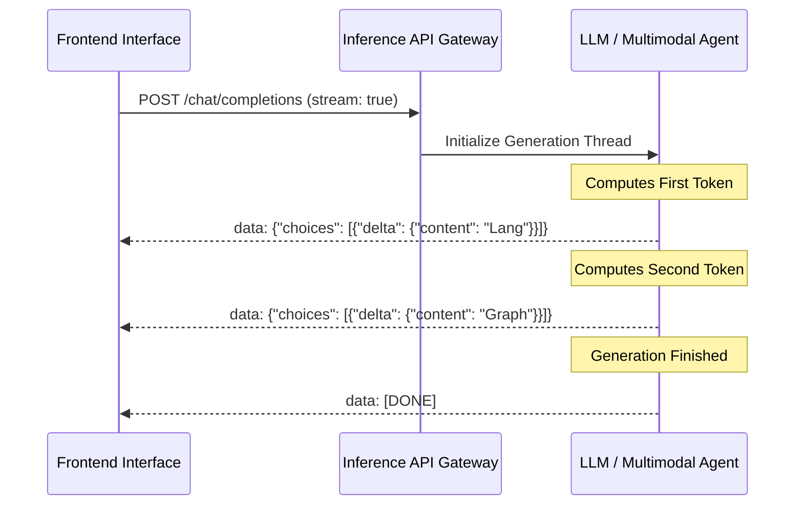

# Enterprise Deep-Dive: Streaming in LLMs, AI/ML & Multimodal Applications

This standalone root tracking manual establishes absolute operational mastery over real-time token extraction architectures. It integrates reference lecture curriculum with advanced industrial research from **Google DeepMind (Gemini Live)** and **OpenAI (SSE streams)**.

---

## 📖 What is Streaming?
**In LLMs, streaming means the model starts sending tokens (words) as soon as they're generated, instead of waiting for the entire response to be ready before returning it.**

---

## 🎯 Why Streaming? (The 6 Core Industrial Use Cases)

Verbatim alignment with advanced systems engineering paradigms:

### 1. Faster Response Time & Low Drop-Off Rates
* **Metrics**: Radically decreases **Time-to-First-Token (TTFT)** from typical 5–10 second blocking windows down to <200 milliseconds. Prevents users from abandoning active loading sessions.

### 2. Mimics Human-Like Conversation
* **Psychology**: Builds trust, feels highly alive, and keeps end-users deeply engaged by replicating natural conversational cadences.

### 3. Important for Multi-Modal UIs
* **Mechanics**: Essential for bidirectional audio interactions (e.g., Gemini Live, OpenAI Voice), rendering spoken word buffers instantly while parsing real-time user interjections.

### 4. Better UX for Long Output such as Code
* **Readability**: Enables developers to visually audit, copy, or execute upstream programming function blocks while subsequent documentation sections are still compiling.

### 5. You Can Cancel Midway Saving Tokens
* **Cost Optimization**: Intercepts generator loops via client connection termination signals. Halting processing blocks early prevents expensive cloud API token billing metrics from accumulating unnecessarily.

### 6. Interleave UI Updates
* **Dynamic Components**: Renders non-textual UI elements instantly during generation turns. Developers can output intermediate state markers like `"thinking..."`, render animated loader spinners, or expose inline formatted tool calculation tables natively.

---

## 🔬 Industry Research: Advanced Streaming Backends

### 🟢 Google Gemini Live & gRPC Streams
Google's Gemini model variants leverage native bidirectional streaming interfaces.
* **Payload Unpacking**: Responses arrive packed inside `GenerateContentResponse` protocol buffers containing continuous delta updates spanning raw string strings, image visual embeddings, and chunked byte sequences targeting client speakers directly.

### 🔵 OpenAI SSE (Server-Sent Events) Architecture
Standard REST implementations emit HTTP chunked transfer boundaries leveraging plain text `text/event-stream` contracts.
* **Mechanics**: Client connection sockets parse individual `data: {...}` lines terminating cleanly upon encountering a `[DONE]` target string, enabling infinite continuous outputs over single persistent TCP tunnels.

---

## 📺 Lecture Chapters Reference
Mapped exactly to your reference video layout structure:
1. **Intro** (`0:00`)
2. **Streaming Demo** (`2:55`)
3. **What is Streaming?** (`4:13`)
4. **Importance of streaming** (`5:35`)
5. **Implementing Streaming** (`12:15`)
6. **Code** (`14:08`)
